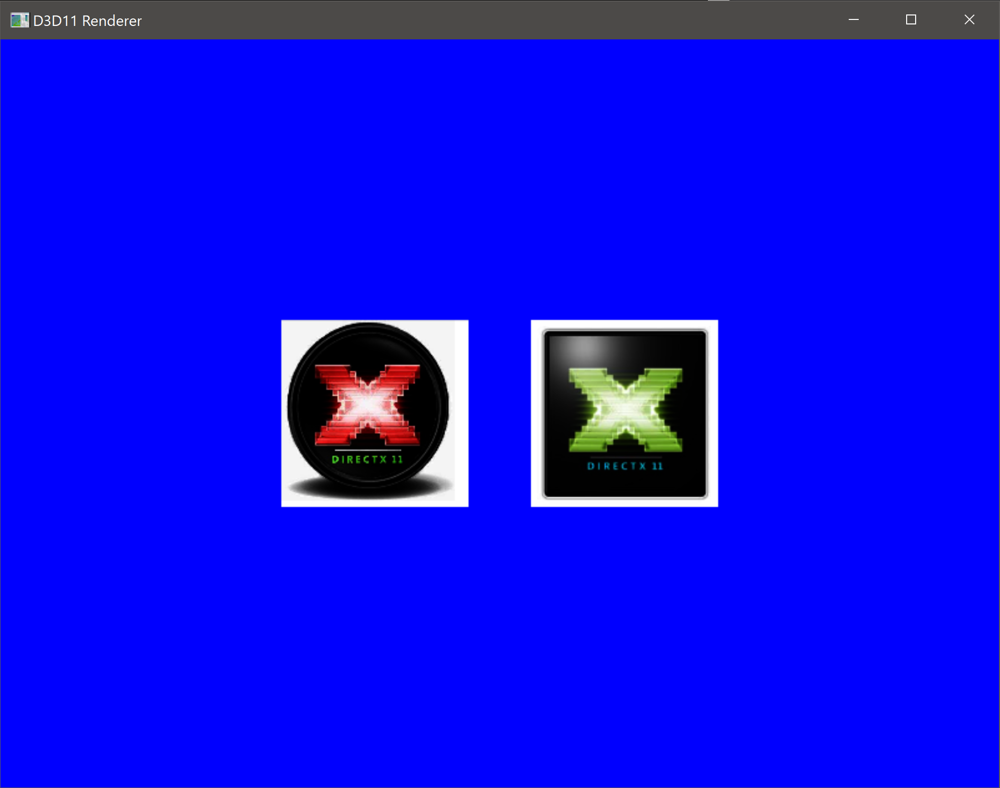

# DirectX11_Triangles_Renderer
A simple program that use DirectX11 to render triangles with texture

About the program
==============
It's a simple program written in C++ using DirectX11 to render triangles with texture.
I used stbi library to load images used for textures.
Vertex shader and pixel shader has been written in HLSL.
